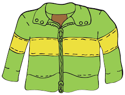

<h1>Welcome</h1>

<b>Learn Spanish</b> is a selection of beginner Spanish lessons, helpful videos, and fun games to help children learn Spanish!

Use the tabs at the top of the page or the buttons below to navigate the website. You can complete the lessons in any order.

 

  

    

      <a href="images/conversation.png">
        
        

          
Learn conversation skills

        

      </a>
    

  

  

    

      <a href="images/time.png">
        
        

          
Learn numbers, weekdays, and months

        

      </a>
    

  

  

    

      <a href="images/bread.png">
        
        

          
Food vocabulary

        

      </a>
    

  

  

    

      <a href="images/jacket.png">
        
        

          
Learn clothing vocabulary

        

      </a>
    

  

   

    

      <a href="images/spanishflag.png">
        
        

          
Learn about Spain

        

      </a>
    

  

